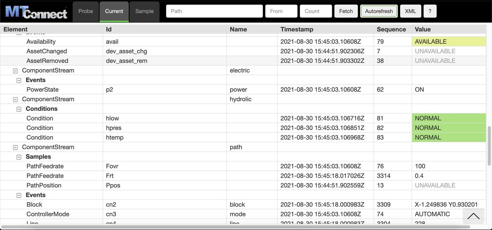

# MTConnect Agent Stylesheet

Stylesheet for the MTConnect Agent - transforms XML data to a grid UI - with tabs for Probe, Current, and Sample endpoints. Uses [Bootstrap](http://getbootstrap.com/) CSS for some styling.




## Installation

1. Copy the contents of this repository into the "Styles" folder for the MTConnect Agent.

2. Edit the Agent's configuration file (e.g. agent.cfg) to look for the stylesheets as shown below:

```
Files {
    styles {
        Path = ../styles
        Location = /styles/
    }
    Favicon {
        Path = ../styles/favicon.ico
        Location = /favicon.ico
    }
}

DevicesStyle { Location = /styles/styles.xsl }
StreamsStyle { Location = /styles/styles.xsl }

```

3. Restart Agent
4. Navigate to Agent's url to view


## Todo

- click row to highlight and switch between current and probe views
- handle all non-standard dataitem elements with generic subtables (currently each subtable type is hardcoded)
- try nbsp instead of white 'x' for indentation
- set max-width for id column and truncate with ellipsis? what set at though? what if someone has wide monitor?
- handle collapsible sections


## Contributing

Note: The MTConnect cppagent doesn't allow using subfolders in the styles folder, so keep it flat.

## License

MIT
